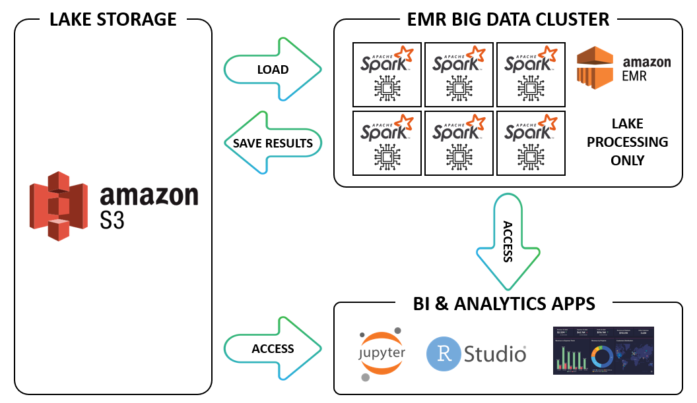

# **DATA LAKE - SPARKIFY**

## **INTRODUCTION**
A music streaming startup, Sparkify, has grown their user base and song database even more and want to move their data warehouse to a data lake. Their data resides in S3, in a directory of JSON logs on user activity on the app, as well as a directory with JSON metadata on the songs in their app.

As their data engineer, I am tasked with building an ETL pipeline that extracts their data from S3, processes them using Spark, and loads the data back into S3 as a set of dimensional tables. This will allow the analytics team to continue finding insights in what songs their users are listening to.

I'll be able to test the database and ETL pipeline by running queries given to me by the analytics team from Sparkify and compare my results with their expected results.

---

## **DATA LAKE WORKFLOW**

---

## **INPUT DATA**

**Song dataset**: The first dataset is a subset of real data from the Million Song Dataset. Each file is in JSON format and contains metadata about a song and the artist of that song. The files are partitioned by the first three letters of each song's track ID. For example, here are filepaths to two files in this dataset.

And below is an example of what a single song file, TRAABJL12903CDCF1A.json, looks like.

**Log dataset**: The second dataset consists of log files in JSON format generated by this event simulator based on the songs in the dataset above. These simulate app activity logs from an imaginary music streaming app based on configuration settings.

The log files in the dataset you'll be working with are partitioned by year and month. For example, here are filepaths to two files in this dataset.

The project datasets can be accessed through the following links:
- **Song data**: *s3://udacity-dend/song_data*
- **Log data**: *s3://udacity-dend/log_data*

---

## **DATABASE SCHEMA**

---

## **FILES DESCRIPTION**
- **etl.py** : Python file which creates the Spark Session
- **DataLakeProject_Local.ipynb**: Jupyter Notebook file containing the same code as etl.py, but showing each of the performed steps and their correspondent results.
- **dl.cfg**: File containing the AWS credentials

---

## **HOW TO RUN THE SCRIPTS?**

**AWS CREDENTIALS**

The AWS Access Key and the AWS Secret Access Key has to be entered in the configuration file (dl.cfg).

In case of using a notebook associated to an EMR Cluster, this file is not necessary.

**PYTHON FILE**

By running the etl.py file, the datasets are downloaded from the Amazon S3 bucket commented above, processed and saved in another Amazon S3 bucket as parquet files.

---
## **LICENSING, AUTHORS, ACKNOWLEDGEMENTS, ETC.**
- **Author**: The author of this project is Gonzalo Gomez Millan
- **Acknowledgment**: Also noteworthy is the work of **Udacity** by promoting  this analysis as one of the projects of the Data Engineering Nanodegree Program.